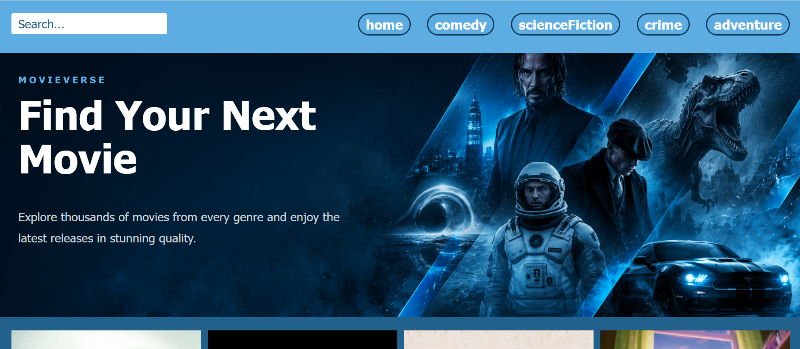
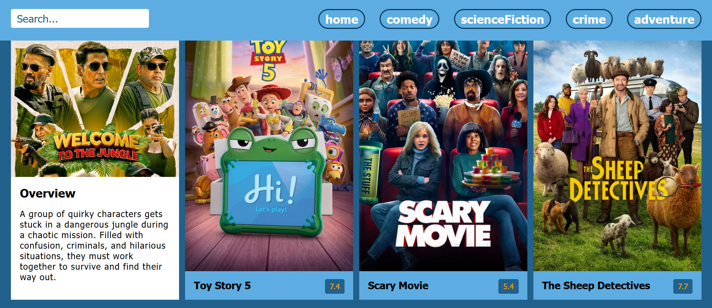

# 🎬 Movie Explorer

A modern movie discovery web application built with **HTML**, **CSS**, and **Vanilla JavaScript** using **The Movie Database (TMDB) API**.

Users can browse popular movies, search for their favorite titles, and explore different movie genres through a clean and responsive interface.

---

## ✨ Features

* Browse popular movies
* Search movies by title
* Browse movies by genre
* Display movie posters
* Show movie ratings with color indicators
* View movie overviews
* Responsive design
* Fetch movie data from the TMDB API

---

## 🛠️ Built With

* HTML5
* CSS3
* JavaScript (ES6+)
* Fetch API
* Async / Await
* TMDB API

---

## 📷 Screenshots





---

## 🚀 Getting Started

1. Clone the repository.

```bash
git clone https://github.com/NargesHaidari/Movie-Explorer-2026-7-2.git
```

2. Open the project folder.

3. Run the project using **Live Server**.

---

## 📁 Project Structure

```text
Movie-Explorer-2026-7-2/
│
├── index.html
├── style.css
├── script.js
├── README.md
└── photos/
    ├── banner.png
    ├── cards.png
    ├── home.png
    └── no-photo.jfif
```

---

## 🔍 API

This project uses **The Movie Database (TMDB) API** to retrieve movie information, including popular movies, search results, genres, posters, ratings, and overviews.

---

## 💡 What I Learned

While building this project, I practiced:

* Working with REST APIs
* Fetching asynchronous data
* Using async/await
* DOM manipulation
* Event handling
* Dynamic UI rendering
* Organizing JavaScript code into reusable functions

---

## 👩‍💻 Author

Developed by **Narges Haidari**.
